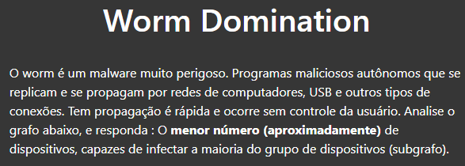
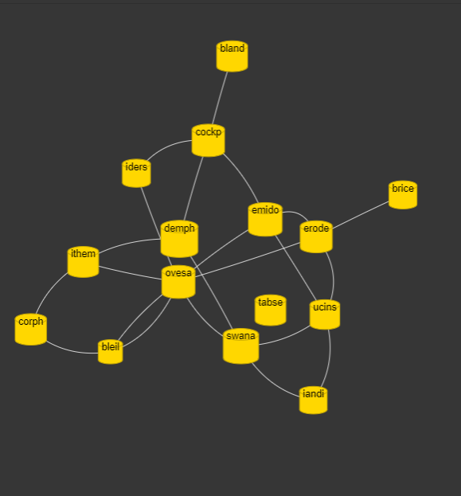

# Worm domination

**Número da Lista**: 8 
**Conteúdo da Disciplina**: Greed 

## Alunos
|Matrícula | Aluno |
| -- | -- |
| 18/0118005	  |  Carlos Rafael Vasconcelos de Matos |
| 17/0020525  |  Pedro Henrique de Lima Malaquias |

## Sobre 
Dado um grafo, o usuário terá que analisar e responder menor número (aproximadamente) de dispositivos, capazes de infectar a maioria dos outros usuários conectados. Considerando que as vertices do grafo são dispositivos, e as arestas, são conexões entre os dispositivos. 

## Screenshots

## Instalação 
**Linguagem**: JavaScript 
**Biblioteca**: Vis.js 

## Uso 
* Internet
* Navegador
* Basta abrir o arquivo [Index.html](src/views/index.html) pelo navegador.
## Algoritmo/Solução 

O algoritmo ultilizado no trabalho (Vertex Cover), faz parte do subconjunto dos problemas NP - Difícil, ou seja, improvável que haja um algoritmo eficiente para resolvê-lo exatamente para grafos arbitrários. Porém, existem soluções por aproximação. 

## Saiba mais : [Vertex Cover](https://en.wikipedia.org/wiki/Vertex_cover)

